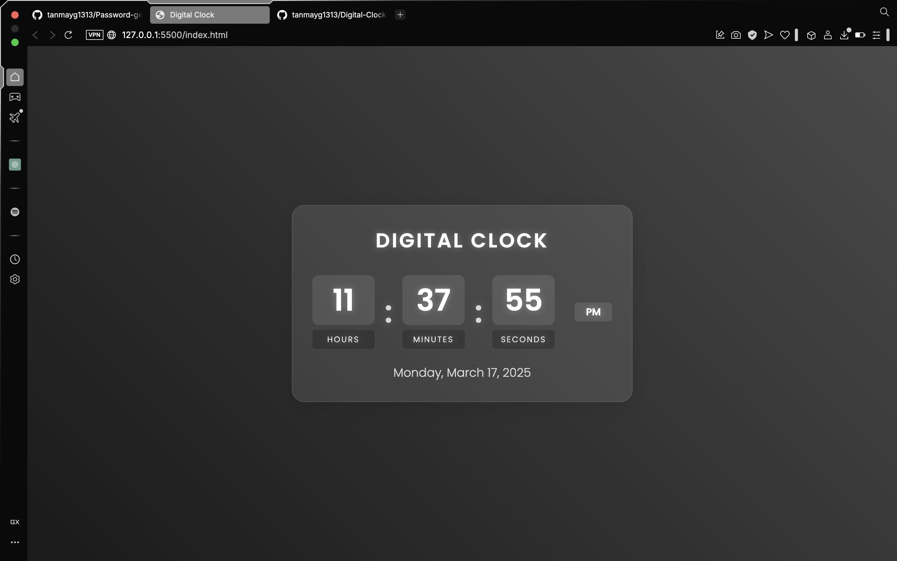

# Digital Clock

A beautiful and modern digital clock built with HTML, CSS, and JavaScript. This project features a sleek design with glass-morphism effects, smooth animations, and real-time updates.

## Features

- Real-time digital clock display
- 12-hour time format with AM/PM indicator
- Current date display
- Modern glass-morphism design
- Responsive layout for all devices
- Smooth animations and hover effects
- Beautiful gradient background

## Technologies Used

- HTML5
- CSS3 (with modern features like glass-morphism)
- Vanilla JavaScript
- Google Fonts (Poppins)
- Font Awesome Icons

## How to Run

1. Clone this repository
2. Open `index.html` in your web browser
3. The clock will start running automatically

## Adding Screenshots to README

To add your screenshot to the README file:

1. Create a folder named `images` in your project root directory
2. Save your screenshot in the `images` folder (e.g., `screenshot.png`)
3. Add the following markdown code to your README:

```markdown
## Screenshot


```

Replace `screenshot.png` with your actual image filename.

## License

This project is open source and available under the MIT License. 